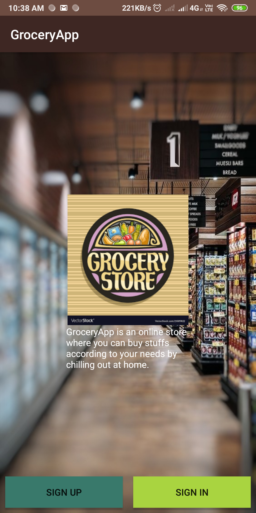
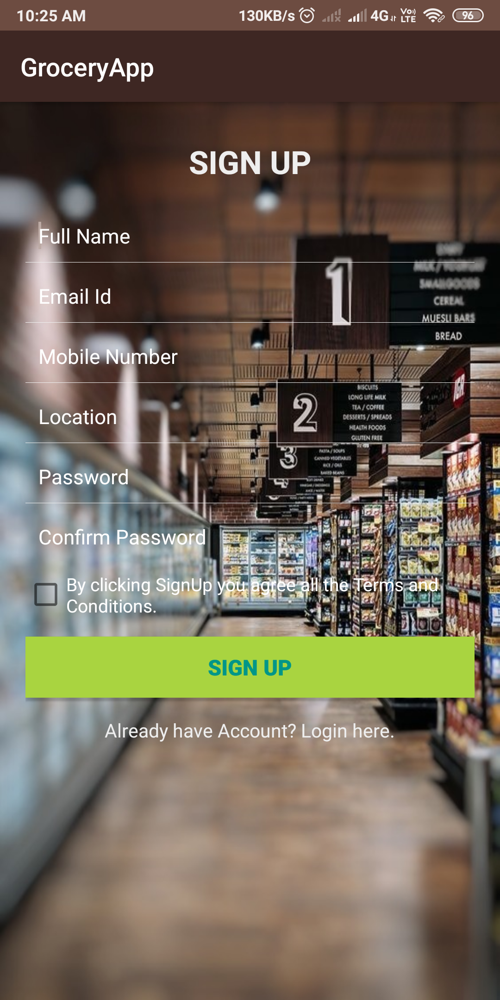
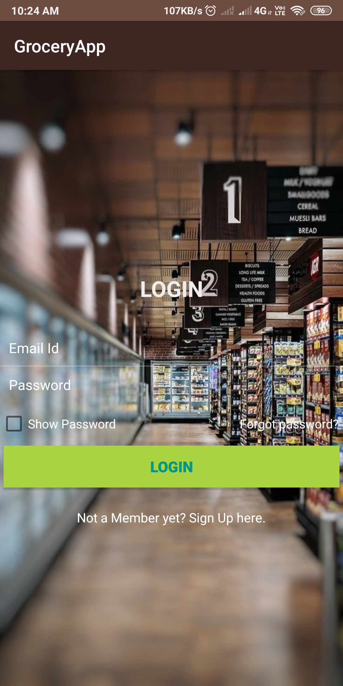
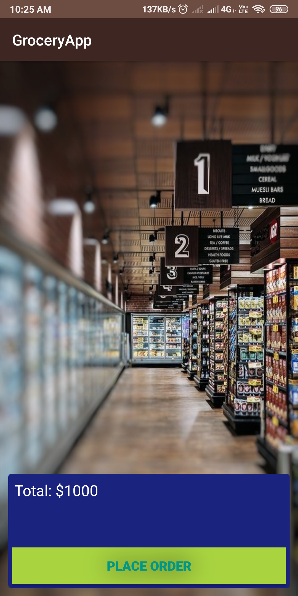

# Simple UI/UX for Grocery Application
### It is an application where you can buy items by chilling out at home :)

## About
#### It is easy to use and handle.
#### It is flexible.

## Screenshots

## Tech Stack 
### In this application, I have used-
#### Language-Java
#### UI/UX-XML
#### It is easy to edit and structured in such a way so that we can add an api and use firebase too,By handling backend.
#### Also added an animation effect for better UI.
